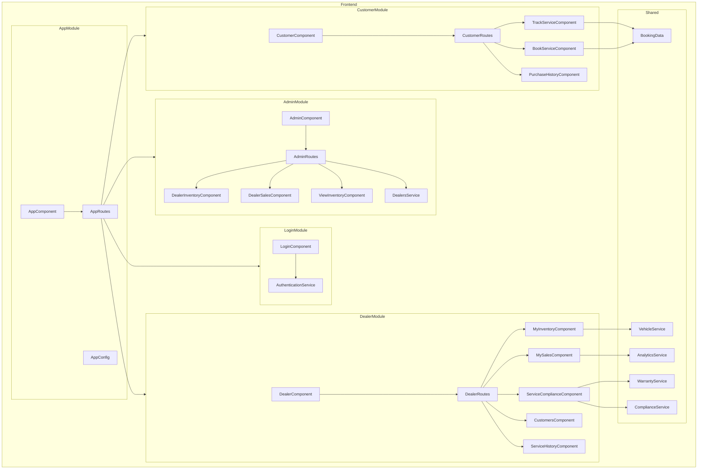

    

    <b>Automatic Architecture Diagrams from Code</b> 
    <a href="https://github.com/swark-io/swark">GitHub</a> • <a href="https://swark.io">Website</a> • <a href="mailto:contact@swark.io">Contact Us</a>

## Usage Instructions

1. **Render the Diagram**: Use the links below to open it in Mermaid Live Editor, or install the [Mermaid Support](https://marketplace.visualstudio.com/items?itemName=bierner.markdown-mermaid) extension.
2. **Recommended Model**: If available for you, use `claude-3.5-sonnet` [language model](vscode://settings/swark.languageModel). It can process more files and generates better diagrams.
3. **Iterate for Best Results**: Language models are non-deterministic. Generate the diagram multiple times and choose the best result.

## Generated Content
**Model**: GPT-4o - [Change Model](vscode://settings/swark.languageModel)  
**Mermaid Live Editor**: [View](https://mermaid.live/view#pako:eNqdVl1PgzAU_StLn-cf2IPJdDGauMQ4oy-8XOEOGqElpdUQ43-30G1QegtRHpZxz-n96r0nfLNUZsg2LBG5grpYvewSsbJPY96d4U5JoVFkzuxB27rey8yUOGDdY823sqqlQKEJRBx5HpifpdHYDOY-IBUyq7ggg3ZALGyHTSN0zw6hRNUcUH3yFCnsQXxad1K1EdeOdbA_TYTxyvFrzkusUueZKtUhswlRxe7bpWL27Vwhpy51aMlBuH8E79Y0Wla2rfN-7nnzx46cHVM9OWMLOVF9uZHyY1QbcfpFQbpAeTIqLaD5R1WPMqcnugdiE210YY08Bc2lCOY3FutQgMIsLJ-LfAcaJoOLBU9LJJdjK6BsbXh6dd5AKRC6JcFhfui0J_mPxWR1dXU9FYvLqwOn8uDD4U75ODVhPsO7rRPBU54hDS_LwTBKJLaPNJvazSlzTmxor8MNOtZEXEbMcT1jS0-JiwtBpSoJaEtyExyI6U7Mc7iqjh9Iied93AXf1tPiYkKQZ3SFYMclxh3x9cLNIS0Tjk9dmRsiYvGnl-bckyoQv7j-ECkOC2cimkH273INnqhR9xIy2ZrZnlfAM_tF9J0w270KE7ZZJSzDI5hSJ-zHkkydgcYdByurFdtoZXDNwGh5aEV6flfS5AXbHKFs8OcXgCgLyg) | [Edit](https://mermaid.live/edit#pako:eNqdVl1PgzAU_StLn-cf2IPJdDGauMQ4oy-8XOEOGqElpdUQ43-30G1QegtRHpZxz-n96r0nfLNUZsg2LBG5grpYvewSsbJPY96d4U5JoVFkzuxB27rey8yUOGDdY823sqqlQKEJRBx5HpifpdHYDOY-IBUyq7ggg3ZALGyHTSN0zw6hRNUcUH3yFCnsQXxad1K1EdeOdbA_TYTxyvFrzkusUueZKtUhswlRxe7bpWL27Vwhpy51aMlBuH8E79Y0Wla2rfN-7nnzx46cHVM9OWMLOVF9uZHyY1QbcfpFQbpAeTIqLaD5R1WPMqcnugdiE210YY08Bc2lCOY3FutQgMIsLJ-LfAcaJoOLBU9LJJdjK6BsbXh6dd5AKRC6JcFhfui0J_mPxWR1dXU9FYvLqwOn8uDD4U75ODVhPsO7rRPBU54hDS_LwTBKJLaPNJvazSlzTmxor8MNOtZEXEbMcT1jS0-JiwtBpSoJaEtyExyI6U7Mc7iqjh9Iied93AXf1tPiYkKQZ3SFYMclxh3x9cLNIS0Tjk9dmRsiYvGnl-bckyoQv7j-ECkOC2cimkH273INnqhR9xIy2ZrZnlfAM_tF9J0w270KE7ZZJSzDI5hSJ-zHkkydgcYdByurFdtoZXDNwGh5aEV6flfS5AXbHKFs8OcXgCgLyg)

